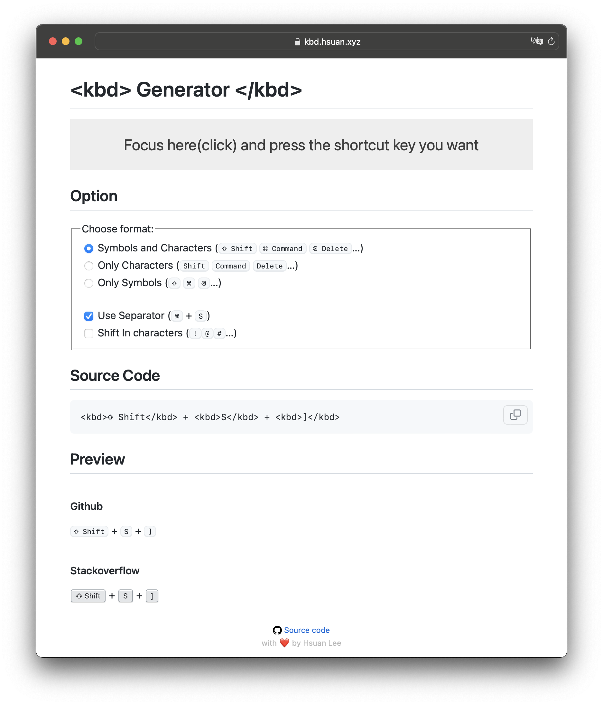

# KbdGenerator

#### [kbd.hsuan.xyz](https://kbd.hsuan.xyz)

    

This project was generated with [Angular CLI](https://github.com/angular/angular-cli) version 13.1.2.

## Development server

Run `ng serve` for a dev server. Navigate to `http://localhost:4200/`. The app will automatically reload if you change any of the source files.

## Build

Run `ng build` to build the project. The build artifacts will be stored in the `dist/` directory.
